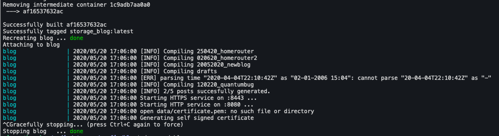

Llevo varios años queriendo hacer un blog. Entre la vaguería y la desidia todas las veces que he intentado iniciarlo el proyecto ha acabado languideciendo conteniendo apenas un par de artículos mediocremente escritos. En este tercer intento me he propuesto empezar de forma diferente. ¿Por qué no intento escribir el backend que se ocupe de servir los artículos desde cero? De esta forma, aún en el hipotético caso de que no llegue a escribir de forma asidua, al menos me quedará el consuelo de que escribí *el blog*.

Sé que hay [muchísimas opciones disponibles](https://www.staticgen.com) para generar y servir una página web estática y estoy seguro de que varias de ellas ofrecen justo las funcionalidades que yo quiero, pero aún así he decidido crear mi pequeña utilidad para esta tarea: Blog. 

Blog es un pequeño binario escrito en Go que es capaz de convertir una estructura de carpetas y documentos escritos en [Markdown](https://guides.github.com/features/mastering-markdown/) en un sencillo blog que intenta ser simple de usar, tener una interfaz limpia y ofrecer un nivel razonable de seguridad.


### Blog es sencillo de usar 

Blog tan sólo necesita un fichero de configuración (`config.yaml`) y una carpeta con posts. El fichero de configuración incluye algunos detalles para personalizar el blog y la localización de la carpeta de posts:

```yaml
---
title: Tidy Bits
subtitle: The blog where I tell my geek adventures
author: Maesoser
author_url: https://github.com/maesoser
url: blog.souvlaki.cf
year: '2020'
posts: "./posts"
```

En la esa carpeta deberían encontrarse los distintos artículos, ordenados como subcarpetas. He elegido esta estructura porque me resulta cómoda a la hora de organizar los distintos recursos que uso en cada artículo.

```
  posts
    ├── 010120_post1
    │   ├── foto1.jpg
    │   └── post.md
    ├── 120220_quantumbug
        ├── 120220_quantumbug.md
        ├── foto2.jpg
        └── foto4.png
```

Iniciar Blog es tan sencillo como:

```bash
blog -port 8080 -tls_port 8443 -config /temp/config.yaml
```



Las plantillas de la página de posts y el índice, así como el estilo CSS utilizado están incluidos en el binario usando [go-bindata](https://github.com/go-bindata/go-bindata).


### Blog es simple

He intentado escribir blog para que sea sencillo, fácil de entender y de  extender. El código apenas supera las 400 líneas. Blog tan sólo usa dos paquetes propios:

- **easycert**: Es un pequeño paquete que se ocupa de emitir certificados autofirmados
- **blog**: Este paquete incluye dos estructuras principales en torno a las que gira toda su operativa:
  - **Blog** : Esta es la estructura que guarda los tags, las entradas de los blogs, su título, etc
  - **Post:** Esta estructura se ocupa de parsear los archivos de texto y generar a partir de ellos el código HTML. Además de eso, guarda los datos básicos de cada post como su fecha, su título, etc.

Los principales paquetes externos que usa blog son:

- **[Gorilla](https://www.gorillatoolkit.org/):** Es un conjunto de utilidades para crear webs en Go. 
- **[gomarkdown](https://github.com/gomarkdown/markdown):** Es el encargado de analizar los documentos en Markdown y traducirlos a html.


### Blog es limpio

Soy un desastre con el diseño. Para conseguir que el blog fuera lo más sencillo posible a la par que agradable y simple de leer empecé usando [Marx](https://mblode.github.io/marx/) como estilo CSS. Sin embargo, me he cambiado a [classless.css](http://classless.de/) que en mi opinión es bastante más limpio y usa unas fuentes más agradables a la vista. El uso de un archivo css sin clases me permite aplicarlo sobre el código html generado desde los ficheros en markdown sin tener que añadir etiquetas extra a los elementos que conforman la web. Añadirlo es tan sencillo como incluir esta línea en la cabecera de mi web:

```html
<link rel='stylesheet' href='/classless.css'>
```

Para colorear los fragmentos de código que añado a mis artículos uso [Highlight.js](https://highlightjs.org/). Añadirlo es igual de sencillo, tan sólo hace falta incluir unas pocas lineas a la cabecera de la plantilla:

```html
<link rel="stylesheet" href="https://cdnjs.cloudflare.com/ajax/libs/highlight.js/10.0.3/styles/tomorrow.min.css">
<style> .hljs { background: #F6F8FA; } </style>
<script src="https://cdnjs.cloudflare.com/ajax/libs/highlight.js/10.0.3/highlight.min.js"></script>
<script>hljs.initHighlightingOnLoad();</script>
```


### Blog es Seguro

Blog escucha por defecto tanto en el puerto 80 como en el puerto 443. Si no se ha incluido un certificado SSL, Blog emite un certificado firmado por él mismo al iniciarse.

Blog también sigue [las recomendaciones básicas](https://blog.gopheracademy.com/advent-2016/exposing-go-on-the-internet/) a la hora de exponer un servicio escrito en Go en Internet.

Blog además está desplegado en un contenedor, con un sólo volumen para que tenga acceso a los artículos. También tiene configurados límites de memoria y de número de procesadores que puede llegar a usar. El contenedor está basado en la imagen [scratch](https://docs.docker.com/develop/develop-images/baseimages/#create-a-simple-parent-image-using-scratch) por lo que no incluye ningún otro binario salvo el propio ejecutable compilado, que se ejecuta con un usuario no privilegiado.

Este es el fichero de docker-compose que lo configura

```yaml
version: "2.4"

services:
  blog:
    container_name: blog
    restart: unless-stopped
    mem_limit: 64m
    build:
     context: ./containers/blog
     dockerfile: Dockerfile
    environment:
     - SERVER_HTTP_PORT=8080
     - SERVER_HTTPS_PORT=8443
    volumes:
     - ./config/blog/config.json:/config.yml
     - ./config/blog/posts:/posts
```


## Resumen

Independientemente de si finalmente consigo imbuirme cierta disciplina y comienzo a escribir de forma regular en esta web, programar esta pequeña utilidad ha sido divertido y me ha servido para practicar en algunos aspectos como la creación de un contenedor, la compilación de un programa con múltiples paquetes en un entorno contenedorizado o para jugar con algunos de los estilos CSS sencillos y elegantes que hay sueltos por Internet.


## Referencias

[Begginers guide to serving files using go](https://medium.com/rungo/beginners-guide-to-serving-files-using-http-servers-in-go-4e542e628eac)

[HTTP2 and TLS client and server example](http://www.inanzzz.com/index.php/post/9ats/http2-and-tls-client-and-server-example-with-golang)

[Docker + Golang = <3](https://www.docker.com/blog/docker-golang/)

[Blog Source Code](https://github.com/maesoser/home-server/tree/master/containers/blog)
