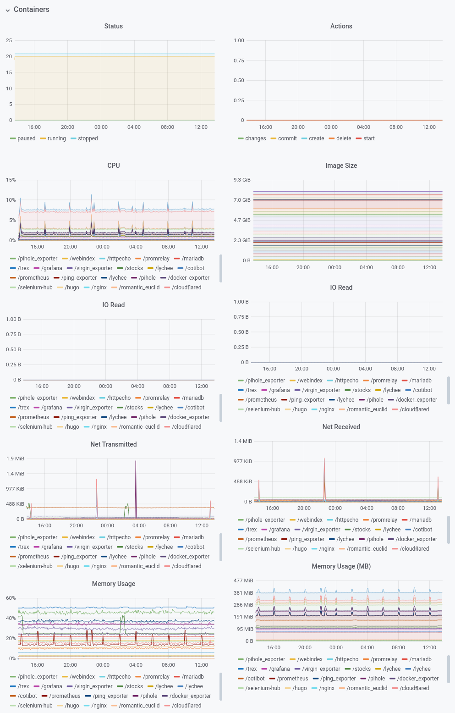

# Docker Exporter

 

docker_exporter exposes metrics related to resource utilization from running containers. It was written cause I wanted an alternative lighter and simpler than [cadvisor](https://github.com/google/cadvisor).

It exposes the following metrics:

```bash
docker_container_status{id="000", name="test_container"} 0
docker_container_created{id="000", name="test_container"} 0

docker_container_net_tx_bytes{id="000", name="test_container"} 0
docker_container_net_rx_bytes{id="000", name="test_container"} 0

docker_container_mem_limit_bytes{id="000", name="test_container"} 0
docker_container_mem_usage_bytes{id="000", name="test_container"} 0
docker_container_mem_usage_pcnt{id="000", name="test_container"} 0

docker_container_io_read_bytes{id="000", name="test_container"} 0
docker_container_io_write_bytes{id="000", name="test_container"} 0

docker_container_pids_count{id="000", name="test_container"} 0

docker_container_cpu_total{id="000", name="test_container"} 0
docker_container_cpu_system{id="000", name="test_container"} 0
docker_container_cpu_count{id="000", name="test_container"} 0
```

