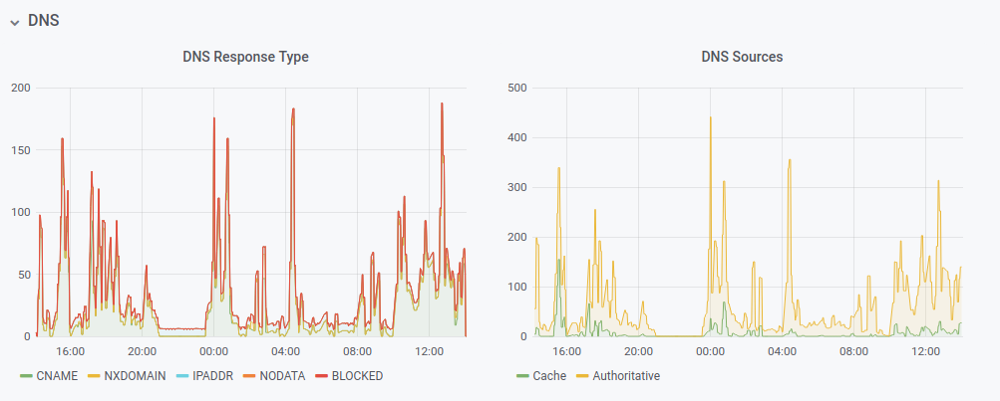

# pihole_exporter



Expose metrics that can be gathered at `http://127.0.0.1:80/admin/api.php?summaryRaw`, using prometheus format:


```bash
pihole_blocked_domains 0
pihole_dns_queries_today 0
pihole_ads_blocked_today 0
pihole_ads_percentage_today 0.0
pihole_unique_domains 0
pihole_queries_forwarded 0
pihole_queries_cached 0
pihole_clients_ever_seen 0
pihole_unique_clients 0
pihole_dns_queries_all_types 0
pihole_reply_nodata 0
pihole_reply_nxdomain 0
pihole_reply_cname 0
pihole_reply_ip 0
pihole_privacy_level 0
pihole_gravity_last_updated 0
```