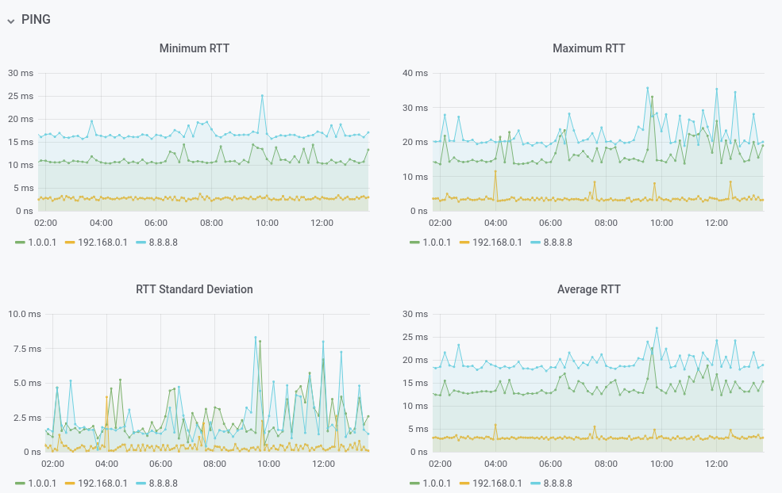

# ping_exporter

Ping_exporter is a [prometheus exporter](https://prometheus.io/docs/instrumenting/exporters/) that is able to send TCP SYN packets as well as ICMP packets towards a hostname or IP address.



This exporter does not use the [Prometheus Library](https://github.com/prometheus/client_golang) and it possibly fails to follow [some of the guidelines](https://prometheus.io/docs/instrumenting/writing_exporters/) given by prometheus to write exporters.

It is written for personal use and for that reason it is not meant to be used on any production system.

### Usage

To get ping results you need to make a get request agains the configured port on the ping_exporter (8080 by default)

```bash
curl "http://127.0.0.1:8080?addr=192.168.1.23&count=3&ttl=12&tos=1&size=1200"
```

Some query parameters can be added to the request:

- **Address:** Target Hostname or IP address. This parameter is needed.
- **Port:** Target port, if this parameter is added, a TCP SYN Ping will be performed and not an ICMP Ping.
- **Count:** This is the number of packets to be sent. It is one by default. 
- **TTL:** This is the Time To Live of the sent packets. It is 128 by default
- **ToS:** IPv4 Type Of Service field. It is 0 by default.
- **Size:** Payload Size. It is 32 bytes by default.

Once the ping has been done, ping_exporter returns the following metrics:

- Minimum TTL received
- Maximum TTL received
- Transmitted packets
- Received packets
- Packet loss percentage
- Minimum RTT
- Maximum RTT
- Average RTT
- RTT Standard deviation

### ICMP Ping example:

```bash
$ curl "http://127.0.0.1:9400?addr=1.1.1.1&count=3&ttl=12&tos=1&size=1200"
ping_ttl_min{host="1.1.1.1",addr="1.1.1.1"} 57
ping_ttl_max{host="1.1.1.1",addr="1.1.1.1"} 57
ping_pkt_tx_count{host="1.1.1.1",addr="1.1.1.1"} 3
ping_pkt_rx_count{host="1.1.1.1",addr="1.1.1.1"} 3
ping_pkt_loss_pcnt{host="1.1.1.1",addr="1.1.1.1"} 0.000000
ping_rtt_min_ns{host="1.1.1.1",addr="1.1.1.1"} 13365267
ping_rtt_max_ns{host="1.1.1.1",addr="1.1.1.1"} 19300968
ping_rtt_avg_ns{host="1.1.1.1",addr="1.1.1.1"} 15747311
ping_rtt_mdev_ns{host="1.1.1.1",addr="1.1.1.1"} 2560942
```

### TCP Ping Example

```bash
$ curl "http://127.0.0.1:9400?addr=1.1.1.1&count=3&ttl=12&tos=1&size=1200&port=53"
ping_pkt_tx_count{host="1.1.1.1",addr="1.1.1.1:53"} 3
ping_pkt_rx_count{host="1.1.1.1",addr="1.1.1.1:53"} 3
ping_pkt_loss_pcnt{host="1.1.1.1",addr="1.1.1.1:53"} 0.000000
ping_rtt_min_ns{host="1.1.1.1",addr="1.1.1.1:53"} 14011090
ping_rtt_max_ns{host="1.1.1.1",addr="1.1.1.1:53"} 17974154
ping_rtt_avg_ns{host="1.1.1.1",addr="1.1.1.1:53"} 15438463
ping_rtt_mdev_ns{host="1.1.1.1",addr="1.1.1.1:53"} 1797729
```

